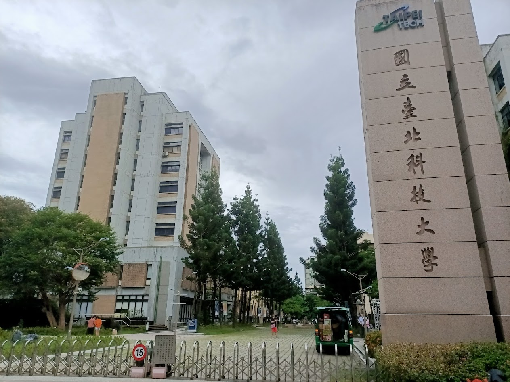

# __OOP2021f__
## <font color=#FF00FF>__This is NTUT OOP(Object Oriented Programming) Course__</font>
<br />



<br />

## *[MSTeams上課錄影](https://youtube.com/playlist?list=PLjGrZCQlR0mB1aqG-_Xa_tugZWuxi9puZ)*

 <br/>

## [課程網頁](./CourseWeb.md) 
 
 <br/>

## __學習筆記__:

<br/>

* Makefile轉寫
    * .PHONY
    * all
    * clean

* Unit Test 
    * ASSERT_EQ
    * ASSERT_NEAR
    * ASSERT_THROW

* 指標與記憶體空間

* 物件導向基礎概念

* Constructor, Deconstructor

* Copy constructor
    * 以防你的class裡面有new的事情，解決double free problem
    * 傳入物件參數時呼叫，對記憶體空間所做的處理，防止裡外兩邊同時指向一樣的空間
    * Compiler做了Copy ellision(複製省略)的動作去加速，所以回傳物件時不會有copy

* & (參照 / 參考 / 別名)
    * 通常要"複製"就是代表說因為變數拿進來，你有可能會改動到變數的內容
    * 但萬一你拿進來卻沒改，那"複製"就會變成一個overhead，避免Copy constructor
    * Pass by reference
    * 就是存取同一份記憶體位址與其內容，賦予其別名，裡面可以直接改動外面的內容
    * 可加上const作保護，
* this-> 的用法
* Overload
* Operator Overloading
    * 乘號與加號的練習

<br />
<br />

> 自己目前進度: 看完10/22的第一節課程

> 不含作業與考試資源，單純複習用!

> Week 10, Week 18 分別為期中期末考週

> 不用去強迫自己記得"全部"的上課內容，最重要是去理解概念，不要有壓力~

> 只要熟練基本OOP概念、Git用法、Test Case寫法這些就OK了!


<br/>

``` c++
while(learning == false){
    cout << "not passed" << endl;
}
```


